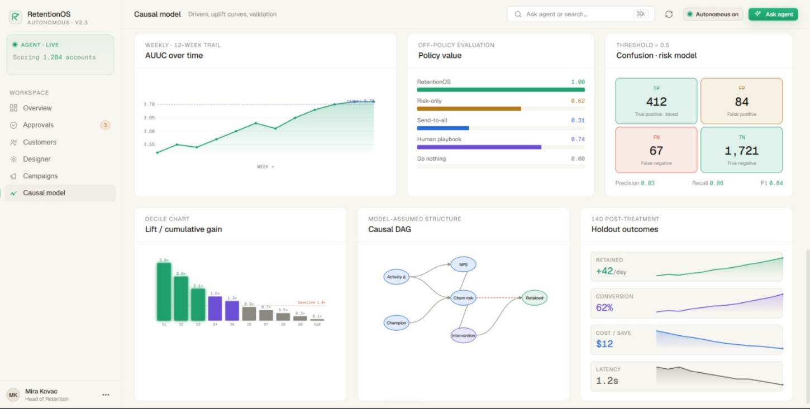

# RetentionOS



AI-powered customer retention platform that predicts churn, identifies persuadable users with uplift modeling, and executes profit-optimized interventions automatically.

---

## Core Flow

```text
Customer Stream
   |
   v
LTV Filtering
   |
   v
Churn Prediction
   |
   v
Causal Uplift Modeling
   |
   v
Treatment Optimization
   |
   v
AI Intervention
   |
   v
Feedback Loop
```

---

## What Is Built

### Frontend Dashboard
- Next.js dashboard with `/overview`, `/approvals`, and `/causal-model` routes.
- Zustand stores for dashboard, approvals, and causal model state.
- Master-detail split layout on `/approvals` for reviewing interventions.
- Route-aware top navbar with dynamic titles and context-aware actions.
- Live data hooks (WebSocket stubs) for approvals, dashboard metrics, and causal updates.
- GPU-safe hover animations using `transform: translateY` for performance.
- CSS Containment on scroll container to prevent unnecessary repaints.

### Core ML Pipeline
- **LTV/CFVS Eligibility Gate MVP**: Historical + predictive LTV scoring, default-risk penalty, and customer financial value scoring (0-100) over synthetic Indian banking data.
- **Churn Prediction MVP**: Logistic classifier trained on Bank Marketing dataset using deposit as churn proxy.
- **Causal Uplift MVP**: X-learner-style multi-treatment model identifying persuadable customers with profit-optimized treatment recommendations.

### Agentic Intervention Pipeline (Full LangGraph)
- **Compliance Agent (Node 1)**: CRAG-based RAG pipeline with multi-query retrieval, pgvector search, Cohere reranking, LLM grader, and compliance verdict (`should_intervene` flag).
- **Strategy Agent (Node 2)**: Determines intervention channel (email/SMS/push), optimal timing (now/delay), and strategy flags (e.g., hard-stop paths).
- **Message Writer Agent (Node 3)**: Drafts HTML email with personalized subject and body using LLM context.
- **Meta Tribe Reviewer Agent (Node 4)**: LLM-based reviewer with corrective loop (max 3 revisions) for quality assurance.
- **Dispatch Agent**: Sends validated messages via Resend (email), Twilio (SMS), or push notifications.
- Unified LangGraph flow: `compliance → strategy → writer ↔ reviewer → pending approval` (production halt before dispatch).

### Human-in-the-Loop Approval System
- `/approvals` page with pending interventions awaiting admin review.
- Admin can review compliance reasoning, channel, scheduled send time, and message preview.
- Admin can edit message copy before approval (UI built, API pending).
- Admin can Approve (queues for send at `scheduled_time`) or Reject (dismisses intervention).
- Production rule: no customer message is sent until admin approval.

### APIs and Backend Services
- **LTV**: `/api/ltv/metrics`, `/api/ltv/retrain`, `/api/ltv/score`
- **Churn**: `/api/churn/metrics`, `/api/churn/retrain`, `/api/churn/score`
- **Causal**: `/api/causal/snapshot`, `/api/causal/retrain`, `/api/causal/score`
- **Interventions** (draft): `/api/interventions/start` (backends nodes 1–4), `/api/approvals`, `/api/approvals/:id/status`
- **WebSocket** (stub): `/ws/approvals` (pending live approval stream), `/ws/metrics` (pending live dashboard stream)

### Data Persistence
- Model artifacts saved to `backend/artifacts/{ltv,churn,causal}/`
- Metrics bundles (JSON, CSV, Markdown reports) saved to `backend/metrics/`
- Supabase PostgreSQL backend with migrations for policy vectors, policy chunks, subscribers, interactions, and pending approvals.
- Resend email delivery with verified domain support.

---

## LTV / Financial Value Model

The LTV MVP integrates the notebook prototype from `backend/models/LTV.py` into the backend architecture:

- Historical LTV: `loan_interest_paid_12m + fee_income_earned_12m - servicing_cost_12m`
- Predictive LTV: estimated future 12-month customer value from segment, income, spend, credit, liquidity, engagement, and risk signals
- Default risk: a separate probability model used to penalize financially risky customers
- CFVS: Customer Financial Value Score from `0` to `100`
- Eligibility gate: medium/high/premium CFVS customers are allowed to enter churn scoring

Important modeling caveat: this MVP trains on synthetic Indian banking data from the prototype until production transaction, balance, product, fee, and servicing-cost history is available.

### LTV Files

```text
backend/create_ltv_model.py
backend/models/ltv_models.py
backend/services/ltv/ltv_service.py
backend/artifacts/ltv/ltv_model.pkl
backend/artifacts/ltv/ltv_metadata.json
backend/metrics/ltv_model_metrics.json
backend/metrics/ltv_model_report.md
backend/metrics/high_value_customers.csv
```

### LTV API

| Method | Endpoint | Purpose |
|---|---|---|
| `GET` | `/api/ltv/metrics` | Load/train LTV artifacts and return gate diagnostics |
| `POST` | `/api/ltv/retrain` | Retrain the LTV/CFVS model and regenerate artifacts plus metrics |
| `POST` | `/api/ltv/score` | Score one customer for financial value and churn-stage eligibility |

### Run The LTV Model

From the backend directory:

```powershell
..\.venv\Scripts\python.exe create_ltv_model.py
```

This writes:

```text
backend/artifacts/ltv/ltv_model.pkl
backend/artifacts/ltv/ltv_metadata.json
backend/metrics/ltv_model_metrics.json
backend/metrics/ltv_model_report.md
backend/metrics/high_value_customers.csv
```

---

## Churn Model

The churn MVP implements a lightweight supervised classifier over the Bank Marketing dataset:

- Outcome `Y`: churn proxy `deposit == "no"`
- Retention proxy: `deposit == "yes"`
- Covariates `X`: customer profile, banking attributes, campaign history, and previous outcome fields
- Leakage exclusion: `duration`, `deposit`, and `contact` are excluded
- Risk gate: customers above the learned threshold are eligible to enter causal uplift scoring

Important modeling caveat: `bank.csv` does not include a true future churn event such as account closure, inactivity, or balance runoff. The current MVP uses failed deposit/subscription as a churn proxy for system integration and model workflow validation. Production churn modeling needs historical customer snapshots and a future churn observation window.

### Churn Files

```text
backend/create_churn_model.py
backend/models/churn_models.py
backend/services/churn/churn_service.py
backend/artifacts/churn/churn_model.pkl
backend/artifacts/churn/churn_metadata.json
backend/metrics/churn_model_metrics.json
backend/metrics/churn_model_report.md
backend/metrics/high_risk_customers.csv
```

### Churn API

| Method | Endpoint | Purpose |
|---|---|---|
| `GET` | `/api/churn/metrics` | Load/train churn artifacts and return the latest metrics bundle |
| `POST` | `/api/churn/retrain` | Retrain from `bank.csv`, save artifacts, and regenerate metrics |
| `POST` | `/api/churn/score` | Score one customer and return churn probability, risk tier, and risk drivers |

### Run The Churn Model

From the backend directory:

```powershell
..\.venv\Scripts\python.exe create_churn_model.py
```

This writes:

```text
backend/artifacts/churn/churn_model.pkl
backend/artifacts/churn/churn_metadata.json
backend/metrics/churn_model_metrics.json
backend/metrics/churn_model_report.md
backend/metrics/high_risk_customers.csv
```

---

## Causal Uplift Model

The uplift MVP implements an X-learner-style flow for the Bank Marketing dataset:

- Outcome `Y`: `deposit == "yes"`
- Treatment proxy `T`: `contact != "unknown"`
- Covariates `X`: customer profile, banking attributes, campaign history, and previous outcome fields
- Leakage exclusion: `duration` is excluded because it is only known after contact starts
- Treatment optimizer: evaluates `discount_5`, `discount_10`, `discount_15`, and `discount_20`
- Profit formula: `expected_profit = uplift * clv - treatment_cost`

Important modeling caveat: `bank.csv` does not include true randomized discount assignment. The current MVP uses contact availability as a proxy for proactive outreach. This is useful for dashboard and integration development, but production causal validity needs real intervention assignment logs and post-intervention outcomes.

### Causal Files

```text
backend/models/causal_models.py
backend/services/causal/uplift_service.py
backend/services/causal/treatment_optimizer.py
frontend/hooks/use-live-causal-model.ts
frontend/components/causal-model/model-metrics-strip.tsx
frontend/lib/api.ts
```

### Causal API

| Method | Endpoint | Purpose |
|---|---|---|
| `GET` | `/api/causal/snapshot` | Train/load cached uplift artifacts and return the dashboard snapshot |
| `POST` | `/api/causal/retrain` | Clear cached artifacts, retrain from `bank.csv`, and return a fresh snapshot |
| `POST` | `/api/causal/score` | Score one customer and return uplift, segment, and best treatment |

### Saved Model Artifacts

The causal model now persists trained artifacts under:

```text
backend/artifacts/causal/uplift_artifacts.pkl
backend/artifacts/causal/uplift_metadata.json
```

Model evaluation outputs are saved under:

```text
backend/metrics/uplift_model_metrics.json
backend/metrics/uplift_model_report.md
backend/metrics/persuadable_customers.csv
```

The metrics bundle includes AUUC, Qini coefficient, churn precision/recall/AUC-ROC, uplift deciles, calibration diagnostics, and the profit-guarded prioritized persuadable list. It is regenerated whenever causal artifacts are saved during retraining.

Runtime behavior:

```text
First snapshot/score request
   |
   v
Load saved artifact if it exists
   |
   v
If missing, train from bank.csv and save artifact
```

`POST /api/causal/retrain` always retrains from `bank.csv`, overwrites the saved artifact, refreshes the in-memory cache, and returns the latest dashboard snapshot.

---

## Human-in-the-Loop Approval System

RetentionOS implements a strict approval gate before any customer outreach:

### Approval Flow

| Step | Actor | Where | Status |
|------|-------|-------|--------|
| 1. Agents draft intervention | LangGraph nodes 1–4 | Backend | **Done** |
| 2. Queue pending approval | Push to `/approvals` | Backend → Frontend WebSocket | **UI done**; API pending |
| 3. Admin reviews | Compliance reasoning, channel, `scheduled_time`, message preview | `/approvals` page | **Done** |
| 4. Admin edits message | Update subject/body before Approve | `approval-detail-view.tsx` | **UI done**; API `PATCH` pending |
| 5. Admin Approve/Reject | Approve queues for send; Reject dismisses | `/approvals` page detail panel | **UI done**; API pending |
| 6. Send to customer | Resend (email) at `scheduled_time` | Trigger.dev + Resend | **Done in test.py only**; production ready after step 5 |

### Approval API (In Progress)

| Method | Endpoint | Purpose | Status |
|--------|----------|---------|--------|
| `POST` | `/api/interventions/start` | Trigger agents 1–4 and persist pending approval | Pending |
| `GET` | `/api/approvals` | List pending approvals | Pending |
| `PATCH` | `/api/approvals/:id` | Update message preview before approval | Pending |
| `POST` | `/api/approvals/:id/status` | Set status to `approved` or `dismissed` | Pending |
| `WS` | `/ws/approvals` | Stream approval updates to frontend | Stub implemented |

### Frontend Approval Components

- `components/approval-row.tsx`: Single approval row in queue (compact view).
- `components/approval-detail-view.tsx`: Master-detail panel for full review and edit.
- `components/approval-message-edit.tsx`: Inline message subject/body editor.
- `hooks/use-live-approvals.ts`: WebSocket hook (stub) to stream approvals into Zustand store.
- `store/approvals-store.ts`: Zustand state for pending queue and detail view.

### Production Rule

**No customer message leaves the backend until admin approval.** Dev `test.py` runs the full graph including dispatch for E2E validation. Production deployment must enforce the halt before `dispatch_agent` and queue the pending approval.

---

## Agentic Intervention Pipeline

The intervention graph processes high-value at-risk customers through a 4-node compliance → strategy → draft → review workflow, then waits for human approval before dispatch.

### Node 1: Compliance Agent (CRAG)

**File:** `backend/services/agents/compliance_agent.py`

Purpose: Determine if the intervention complies with policy and regulatory rules.

**RAG Pipeline** (`backend/services/rag/compliance_service.py`):
1. **Multi-query expansion**: Rephrase the customer scenario into 3–5 policy-relevant queries.
2. **Chunk retrieval**: Use pgvector to retrieve top-K policy chunks from `policy_chunks` table (RPC: `match_policy_chunks`).
3. **Reranking**: Cohere rerank + reciprocal rank fusion (RRF) for multi-query results.
4. **LLM grader**: Assess retrieved chunk relevance; fallback to local cosine similarity if pgvector returns empty.
5. **Reasoning trace**: LLM generates compliance reasoning (stored in approval context).
6. **Verdict**: `should_intervene: true/false` and reasoning.

**Output:** `ComplianceVerdict(should_intervene, reasoning)`

**Known Issue:** If `policy_chunks` table is small or pgvector index has low effectiveness, retrieval may return empty. Workaround: run `backend/migrations/004_fix_policy_vector_index.sql` on Supabase or use local cosine fallback (automatic).

### Node 2: Strategy Agent

**File:** `backend/services/agents/strategy_agent.py`

Purpose: Select intervention channel (email/SMS/push), optimal send time, and strategy flags.

**Inputs:**
- Compliance verdict
- Customer churn risk tier
- LTV/CFVS score
- Causal uplift segment

**Outputs:**
- `channel`: email | sms | push
- `scheduled_time`: ISO timestamp (now or future)
- `strategy_flags`: e.g., hard-stop if causal segment is Lost Cause
- `intervention_reason`: human-readable strategy explanation

**Conditional Graph:** If compliance hard-stops, strategy is skipped (rule-based hard-stop path).

### Node 3: Message Writer

**File:** `backend/services/writer/writer_service.py`

Purpose: Draft personalized intervention message.

**Inputs:**
- Customer profile (name, segment)
- Churn risk
- Causal uplift score
- Strategy context

**Template:** HTML email with dynamic subject and body generated by LLM.

**Outputs:**
- `subject`: Email subject line
- `body`: HTML email body
- `channel`: Reaffirm channel (email/SMS/push)

**Rule:** Writer drafts only; does not send to Resend directly.

### Node 4: Meta Tribe Reviewer

**File:** `backend/services/meta_tribe/meta_tribe_service.py`

Purpose: Quality-check draft message for tone, clarity, and policy adherence.

**Corrective Loop:**
- LLM reviews draft.
- If `quality_score < threshold`, request revision from writer (recursive call).
- Max 3 revisions per intervention.

**Outputs:**
- `quality_score`: 0–1
- `feedback`: Revision notes (if any)
- `final_message`: Approved draft

**Rule:** Reviewer approves drafts; does not send.

### Full Graph Flow

```text
Customer payload (churn risk, LTV, uplift score)
   |
   v
Compliance Agent (RAG verdict)
   | compliance_fail → hard-stop (no send)
   | compliance_pass ↓
Strategy Agent (channel, timing)
   |
   v
Writer Agent (draft message)
   |
   v
Reviewer Agent (quality check → revise if needed)
   |
   v
Pending Approval (queue in database)
   | admin_reject → dismiss
   | admin_approve ↓
Trigger.dev wait_until(scheduled_time)
   |
   v
Dispatch (Resend email, Twilio SMS, push)
   |
   v
Outcome tracking
```

### Test Files

- `backend/test_writer.py`: Writer agent E2E with LLM revision.
- `backend/test_reviewer.py`: Reviewer agent corrective loop.
- `backend/test.py`: Full pipeline including Resend email dispatch (dev only).

---

## Tech Stack

| Layer | Stack |
|---|---|
| Frontend | Next.js 16, TypeScript |
| UI | Tailwind CSS, shadcn/ui |
| State | Zustand |
| Charts | Recharts |
| Backend | FastAPI |
| Agents | LangChain, LangGraph |
| ML MVP | Python stdlib LTV/CFVS gate, churn classifier, and X-learner-style uplift implementation |
| ML Upgrade Path | pandas, numpy, scikit-learn, XGBoost, joblib |
| Database | Supabase PostgreSQL |
| Async Jobs | Inngest / Trigger-style task orchestration |
| Notifications | Twilio, Resend |

---

## Project Structure

```text
RetentionOs/
|-- backend/
|   |-- app.py
|   |-- create_ltv_model.py
|   |-- create_churn_model.py
|   |-- data/
|   |   `-- bank.csv
|   |-- artifacts/
|   |   |-- ltv/
|   |   |   |-- ltv_model.pkl
|   |   |   `-- ltv_metadata.json
|   |   |-- churn/
|   |   |   |-- churn_model.pkl
|   |   |   `-- churn_metadata.json
|   |   `-- causal/
|   |       |-- uplift_artifacts.pkl
|   |       `-- uplift_metadata.json
|   |-- models/
|   |   |-- ltv_models.py
|   |   |-- causal_models.py
|   |   |-- compliance_models.py
|   |   `-- strategy_models.py
|   |-- services/
|   |   |-- ltv/
|   |   |-- churn/
|   |   |-- causal/
|   |   |-- agents/
|   |   |-- rag/
|   |   `-- strategy/
|   |-- prompts/
|   |-- utils/
|   |-- migrations/
|   |-- requirements.txt
|   |-- requirements-ml.txt
|   `-- requirements-agentic.txt
|
|-- frontend/
|   |-- app/
|   |-- components/
|   |-- hooks/
|   |-- lib/
|   |-- store/
|   `-- package.json
|
|-- context/
|-- assets/
`-- README.md
```

---

## Run Locally

Use two terminals: one for the backend and one for the frontend.

### 1. Backend

From the repo root:

```powershell
.\.venv\Scripts\python.exe -m pip install -r backend\requirements.txt
cd backend
..\.venv\Scripts\python.exe -m uvicorn app:app --host 127.0.0.1 --port 8000 --reload
```

`backend/requirements.txt` is the default install for the FastAPI backend and causal model. The current causal MVP is stdlib-only beyond FastAPI/Pydantic. Optional packages live in separate files:

- `backend/requirements-ml.txt` for pandas, scikit-learn, XGBoost, and joblib
- `backend/requirements-agentic.txt` for LangGraph, RAG, Supabase, embeddings, and Cohere

Health check:

```powershell
Invoke-WebRequest -UseBasicParsing http://127.0.0.1:8000/health
```

If port `8000` is already occupied, either stop the existing Python process or run on another port:

```powershell
netstat -ano | Select-String ':8000'
Stop-Process -Id <PID>

# or use another port
..\.venv\Scripts\python.exe -m uvicorn app:app --host 127.0.0.1 --port 8001 --reload
```

When using another backend port, update `frontend/.env.local`:

```env
NEXT_PUBLIC_API_URL=http://127.0.0.1:8001
```

### 2. Frontend

From a second terminal:

```powershell
cd frontend
npm.cmd install
npm.cmd run dev
```

Open:

```text
http://127.0.0.1:3000/causal-model
```

The frontend defaults to `http://localhost:8000` for backend API calls. To override it, create `frontend/.env.local`:

```env
NEXT_PUBLIC_API_URL=http://127.0.0.1:8000
```

### Optional Agentic/RAG Dependencies

Optional production ML stack:

```powershell
.\.venv\Scripts\python.exe -m pip install -r backend\requirements-ml.txt
```

Only install this stack when working on compliance RAG, LangGraph agents, Supabase, or embeddings:

```powershell
.\.venv\Scripts\python.exe -m pip install -r backend\requirements-agentic.txt
```

On Python 3.14, current Supabase storage dependencies can try to compile `pyiceberg`, which requires Microsoft C++ Build Tools. For agentic/RAG work, Python 3.10-3.12 is the safer environment. The causal model does not require this optional stack.

---

## Run The Uplift Model

### Get Dashboard Snapshot

This trains or loads cached uplift artifacts and returns the exact payload consumed by the causal dashboard.

```powershell
Invoke-WebRequest -UseBasicParsing http://127.0.0.1:8000/api/causal/snapshot
```

### Retrain The Model

This clears the in-process cache, retrains from `backend/data/bank.csv`, saves the model to `backend/artifacts/causal/uplift_artifacts.pkl`, writes metadata to `backend/artifacts/causal/uplift_metadata.json`, and returns a fresh dashboard snapshot.

```powershell
Invoke-WebRequest -UseBasicParsing -Method Post http://127.0.0.1:8000/api/causal/retrain
```

### Score One Customer

```powershell
$body = @{
  clv = 2000
  customer = @{
    age = 59
    job = "admin."
    marital = "married"
    education = "secondary"
    default = "no"
    balance = 2343
    housing = "yes"
    loan = "no"
    contact = "unknown"
    day = 5
    month = "may"
    campaign = 1
    pdays = -1
    previous = 0
    poutcome = "unknown"
  }
} | ConvertTo-Json

Invoke-WebRequest `
  -UseBasicParsing `
  -Method Post `
  -ContentType "application/json" `
  -Body $body `
  http://127.0.0.1:8000/api/causal/score
```

The scoring response includes:

- `uplift_score`
- `propensity`
- `baseline_stay_probability`
- `treated_stay_probability`
- causal segment: `Persuadables`, `Sure Things`, `Lost Causes`, or `Sleeping Dogs`
- ranked treatment recommendations with expected profit

---

## Running the Full Agentic Pipeline (Dev)

### End-to-End Test: Compliance → Strategy → Writer → Reviewer → Resend

From the backend directory:

```powershell
..\.venv\Scripts\python.exe -m pip install -r requirements-agentic.txt
..\.venv\Scripts\python.exe test.py
```

This runs the full LangGraph pipeline:

1. **Compliance Agent**: Loads policy chunks from Supabase, retrieves + grades against policy, outputs `should_intervene`.
2. **Strategy Agent**: Selects channel and timing.
3. **Message Writer**: Drafts HTML email.
4. **Meta Tribe Reviewer**: Quality checks and revises (up to 3 times).
5. **Dispatch**: Sends email via Resend to `TEST_RECIPIENT_EMAIL` (configured in `.env`).

**Expected output:**
- Compliance reasoning trace
- Strategy channel + scheduled_time
- Final message subject + body
- Email sent log

**Note:** `test.py` includes dispatch for dev verification. Production deployment must halt before dispatch and queue the pending approval for admin review.

### Configuration for Agentic Tests

Create `backend/.env`:

```env
# Supabase
SUPABASE_URL=https://your-project.supabase.co
SUPABASE_KEY=your-anon-key
SUPABASE_SERVICE_ROLE_KEY=your-service-role-key

# LLM
OPENAI_API_KEY=sk-...
COHERE_API_KEY=...

# Notifications
RESEND_API_KEY=re_...
RESEND_FROM_EMAIL=onboarding@resend.dev
TEST_RECIPIENT_EMAIL=your-email@example.com

# LangChain (optional)
LANGCHAIN_API_KEY=...

# Trigger.dev (optional)
TRIGGER_API_KEY=...
```

### Minimal Test (LTV + Churn + Causal Only)

If agentic dependencies are not installed, the core ML pipeline still works:

```powershell
# No agentic dependencies needed
Invoke-WebRequest -UseBasicParsing http://127.0.0.1:8000/api/ltv/metrics
Invoke-WebRequest -UseBasicParsing http://127.0.0.1:8000/api/churn/metrics
Invoke-WebRequest -UseBasicParsing http://127.0.0.1:8000/api/causal/snapshot
```

---

## Approvals Management (API — In Progress)

### Pending API Endpoints

These endpoints are UI-ready but backend implementation is pending:

| Method | Endpoint | Purpose |
|--------|----------|---------|
| `POST` | `/api/interventions/start` | Trigger agents 1–4, persist pending approval |
| `GET` | `/api/approvals` | List all pending approvals |
| `GET` | `/api/approvals/:id` | Get single approval detail |
| `PATCH` | `/api/approvals/:id` | Update message preview or other fields |
| `POST` | `/api/approvals/:id/status` | Set status (`approved`, `dismissed`, `sent`, `failed`) |
| `WS` | `/ws/approvals` | Stream approval events to connected clients |

### WebSocket Stub Implementation

Frontend hook `hooks/use-live-approvals.ts` has a WebSocket stub block:

```typescript
// PENDING: Live Data
// ws.onmessage = (event) => {
//   const approval = JSON.parse(event.data);
//   store.addApproval(approval);
// };
```

When the backend is ready, uncomment and wire to `store.addApproval()`. Zero UI rewrites are needed.

---

## Environment Variables

### Core ML Pipeline (Required for causal/churn/LTV)

None required for the causal MVP — it runs from `bank.csv` without external keys.

### Agentic/RAG Features (Optional, for compliance agent + strategy agent + writer + reviewer)

```env
# LLM (OpenAI required for writer/reviewer)
OPENAI_API_KEY=sk-...

# Supabase (PostgreSQL + pgvector)
SUPABASE_URL=https://your-project.supabase.co
SUPABASE_KEY=your-anon-key
SUPABASE_SERVICE_ROLE_KEY=your-service-role-key

# Embeddings & Reranking
COHERE_API_KEY=...

# LangChain tracing (optional)
LANGCHAIN_API_KEY=...

# Email delivery
RESEND_API_KEY=re_...
RESEND_FROM_EMAIL=onboarding@resend.dev  # Must be verified at resend.com/domains
TEST_RECIPIENT_EMAIL=your-email@example.com  # Dev recipient for test.py

# SMS delivery (Twilio stub in code)
TWILIO_ACCOUNT_SID=...
TWILIO_AUTH_TOKEN=...

# Task orchestration (optional, future)
TRIGGER_API_KEY=...
```

### Notes on Python Versions

- Python 3.10–3.12: Recommended for agentic stack (Supabase dependencies safe).
- Python 3.14+: Causal ML pipeline works fine; agentic stack may encounter `pyiceberg` compilation issues (requires Microsoft C++ Build Tools).

---

## Verification

Current implementation status:

- ✅ Backend causal routes import and register successfully.
- ✅ `/api/causal/snapshot` returns a snapshot for 11,162 rows from `bank.csv`.
- ✅ `/api/churn/metrics` trains and scores churn model.
- ✅ `/api/ltv/metrics` trains and scores LTV/CFVS model.
- ✅ Frontend production build passes with `npm.cmd run build`.
- ✅ Compliance Agent (Node 1) RAG pipeline tested in `backend/test.py`.
- ✅ Strategy Agent (Node 2) tested in full pipeline.
- ✅ Message Writer (Node 3) tested in `backend/test_writer.py`.
- ✅ Meta Tribe Reviewer (Node 4) tested in `backend/test_reviewer.py`.
- ✅ Full LangGraph pipeline end-to-end (nodes 1–4 + Resend dispatch) verified in `backend/test.py`.
- ⚠️  `/approvals` UI is complete; backend approval API endpoints pending.
- ⚠️  WebSocket stubs (`/ws/approvals`, `/ws/metrics`) in frontend; backend implementation pending.
- ⚠️  `npm.cmd run lint` has pre-existing unrelated errors in approval/UI/mobile components.

---

## Known Issues and Operational Notes

### pgvector Retrieval Empty Results (Not a CRAG Logic Bug)

**Symptom:** `Retrieved 0 unique chunks` → compliance hard-stops → looks like RAG failed.

**Root Cause:** IVFFlat index on `policy_chunks` table with `lists = 100` performs poorly when the table has very few rows (common in early dev and `test.py`). Ingest/upsert can succeed while `match_policy_chunks` RPC returns `[]`.

**Fix:** Run `backend/migrations/004_fix_policy_vector_index.sql` on Supabase. Alternatively, `compliance_service.py` automatically falls back to local cosine similarity when RPC returns empty results (see log: `RPC empty - used local cosine fallback`).

**Agent Rule:** Do not refactor `compliance_service`, grader, or prompts for this symptom. Verify `policy_chunks` row count and retrieval status first. See `context/AGENTS.md` § Backend CRAG / RAG.

### Resend Email Verification (Operational)

- **FROM:** Must be a verified domain at resend.com/domains, or sandbox `onboarding@resend.dev`.
- **TO:** Dev recipient (e.g., Gmail) can be any address. Tests use `TEST_RECIPIENT_EMAIL` from `.env`.
- **First send:** May take 1–2 seconds if Resend account is new or domain is cold.

### Message Edit API Not Yet Wired

- UI (`approval-detail-view.tsx`, `approval-message-edit.tsx`) is complete.
- `PATCH /api/approvals/:id` API call is stubbed (`// PENDING`).
- When backend implements, frontend requires zero rewrites.

### Approval Status Tracking

Production rules:
- `pending`: Intervention drafted, awaiting admin review.
- `approved`: Admin approved; message is queued for send at `scheduled_time`.
- `dismissed`: Admin rejected; intervention is dropped.
- `sent`: Message successfully delivered.
- `failed`: Delivery error (manual retry or escalation needed).

---

## Architecture Decisions and Best Practices

### Routing & State Management
- **Sidebar routing**: Determined purely by `usePathname()` — deterministic, no client state needed.
- **Zustand for live data**: All business state lives in stores (`dashboard-store`, `approvals-store`, `causal-model-store`). Components are consumers only. Live data hookups require only hook changes, not component rewrites.

### Performance & Rendering
- **GPU-safe hover animations**: All cards use `transform: translateY` + `will-change: transform`. `box-shadow` and `background-color` transitions were removed.
- **CSS Containment**: Main scrollable `<main>` uses `contain: layout style` to prevent sidebar/topnav repaints during scroll.

### Backend Architecture
- **Thin FastAPI routes**: Business logic lives in `backend/services`.
- **Schemas in models**: All request/response pydantic models in `backend/models`.
- **Separate services**: LTV, churn, causal, compliance, strategy, writer, reviewer — each has its own service module.
- **Artifact persistence**: All trained models saved to `backend/artifacts/{service}/*.pkl` for fast reload.

### ML Pipeline Rules
- **Exclude leakage fields**: `duration`, `contact`, `deposit` are proxy fields known only after intervention — never train on them.
- **Default to stdlib**: causal MVP uses stdlib classifiers. XGBoost/lightgbm upgrades are documented in `backend/metrics/x_learner_reference.py`.
- **Long-running retraining**: Future improvement — move to Inngest/Trigger.dev async jobs instead of synchronous API calls.

### Human-in-the-Loop Rule
- **No customer message leaves the backend until admin approval.**
- Dev `test.py` includes dispatch for E2E testing.
- Production deployment must halt the graph before `dispatch_agent` and queue pending approvals.

---


